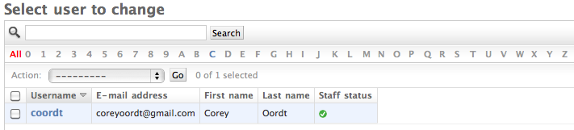

====================
The Default Alphabet
====================

``django-alphafilter`` will always show the letters that are filterable based on data in the model, regardless of the language or encoding. It also displays, by default, the ASCII alphabet and digits as disabled characters.

Changing the Default Alphabet
=============================

The configuration setting ``DEFAULT_ALPHABET`` can be a string, tuple, list or callable that returns a string, list or tuple.

If you only what the ASCII characters, no digits::

	DEFAULT_ALPHABET = u'ABCDEFGHIJKLMNOPQRSTUVWXYZ'

For the German alphabet::

	DEFAULT_ALPHABET = u'0123456789A\xc4BCDEFGHIJKLMNO\xd6PQRS\xdfTU\xdcVWXYZ'

For the Icelandic alphabet::

	DEFAULT_ALPHABET = u'0123456789A\xc1BD\xd0E\xc9FGHI\xcdJKLMNO\xd3PRSTU\xdaVXY\xdd\xde\xd6'

To show nothing except the characters in the data::

	DEFAULT_ALPHABET = u''

Add ``DEFAULT_ALPHABET`` to the project's ``settings.py`` to for a global change.

Add a ``DEFAULT_ALPHABET`` attribute on your model to change it on a model-by-model basis.
